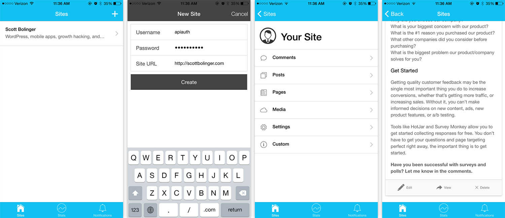

# WP App

An open source, customizable mobile app for WordPress management.

## The Idea

Create a customizable mobile app for managing self-hosted WordPress sites.

Allow developers to create plugins that interface with the app to create custom pages, and add custom data from the site.  The app itself will have hooks to add pages, for example an ecommerce plugin could add a sales statistics page.

The existing app is great, but it doesn’t support CPTs, and it isn’t customizable.  Some plugin authors have created single purpose plugins for things like sales statistics. Combining site management and custom data into one app would be more convenient.

Developers will be able to add, edit, and remove pages and functionality to the app remotely through plugins.

The app itself will be on the app store, you can add multiple sites by adding a username, password, and url, similar to the existing WordPress app.

Developers can write simple plugins that add data to the WP-API to customize the app.

Since the WP-API plugin is not in core yet, the app requires installation of the WP-API (v2), and possibly another plugin (for authentication).  The idea is to get the app into beta for testing, then when the WP-API gets into core, it will be ready to go.

This project is intended to be by the community, for the community.

## Try it out

To see this project in action, download the wp-app/www folder, and open wp-app/www/index.html in Safari or Chrome. Click '+' to add a new site, the site must have the WP-API v2 installed and activated: [https://wordpress.org/plugins/rest-api/](https://wordpress.org/plugins/rest-api/)

## Technical Details

The app is a hybrid app built with the Ionic Framework, which uses AngularJS.

The app accesses the WP-API on a self-hosted WordPress website.

### Why not a fully native app?

The WordPress community is made up of web developers, so building the app with web technologies allows more people to participate.  The Ionic Framework creates fast, performant apps.  While fully native apps have the best performance, hybrid apps can still be incredibly good if built well.

### What will the app cost?

The app itself will always be free, there will never be a mandatory cost to use the app.

There will be costs associated with push notifications, hosting, etc. that mean this app will need to make revenue at some point.  

The idea is to create paid plugins that add functionality to the app worth paying for, and charging for those plugins.  No core functionality will cost money, only add-ons.  For example, a plugin developer could charge for a plugin that adds their CPT to the app.

## Project Outline

At this point we need contributors who are familiar with AngularJS and the WP-API.

The app is semi-functional at this point, it needs a lot of work to get to the point where millions of people can use it flawlessly.

We can add features one at a time to break the project into manageable chunks. For example, I have no intention of adding a post editor anytime soon.  I never write posts on my phone, I don’t really think that’s useful.  If you want that, you can just use the other app.

The point of this app is to add stuff that’s actually useful on the go, like viewing and approving comments, or getting custom data from plugins.  Then making everything customizable.

### Alpha Release

The first goal is to get to an alpha release, with minimal features.

Minimal features: Multiple site support, CRUD comments, GET/DELETE posts/media/pages, edit site settings.

#### Outstanding items:

1. Secure, scalable data storage (right now it’s just using local storage, but there’s a 5mb limit)
2. Secure authentication (probably Oauth)
3. Outline methods for adding custom pages and data
4. Better caching and data loading
5. Submit to app stores and begin testing

#### Next Phases

- POST/PUT on most endpoints
- CPT support
- Figure out push notifications
- Custom Design
- Lots more…

## How to Contribute

Join our Slack channel and introduce yourself: wp-app.slack.com

The first step is just to make some plans, then write them out and assign them.

### Setup this project locally

1. Install Ionic CLI tools
2. Create your Ionic project: $ ionic start wp-app
3. Replace your www folder with the www folder in this repo

- Build your app $ ionic build ios
- Test in browser $ ionic serve --lab